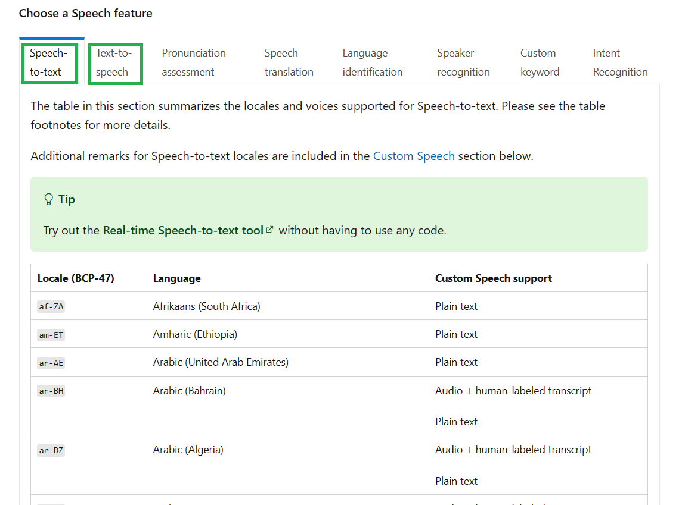
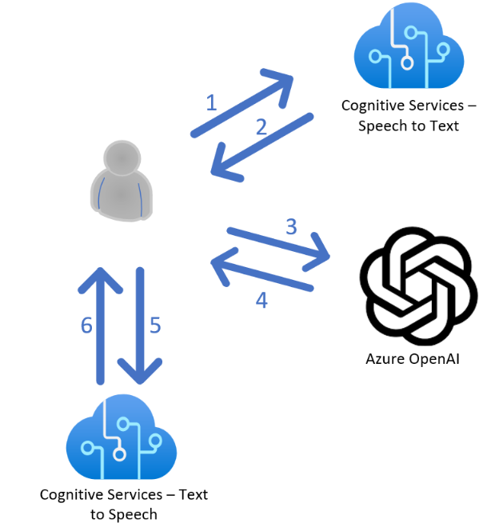
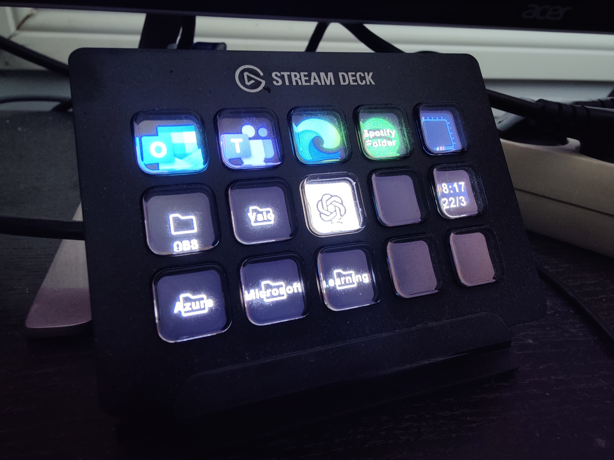
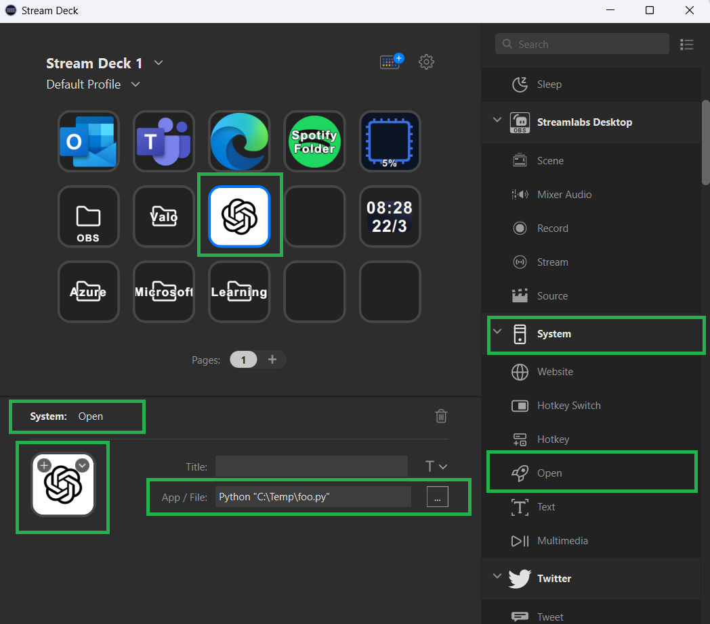

# AI Personal Assistant

Idea of this project was to create a personal assistant who hears what user speaks and answers back using Azure Cognitive Services and Azure ChatGPT \ GPT-4.
User can change the personal assistant language and voice by selecting them from these lists: https://learn.microsoft.com/en-us/azure/cognitive-services/speech-service/language-support?tabs=tts


## Current State
  * MVP functional by using Azure ChatGPT and GPT-4
  * (Azure OpenAI version works too)
  * Azure Cognitive Services handles voice capture and speech
  * (optional) Uses stream deck to initialize communication


## How it works
  
  1. User starts the program and speaks to microphone. Speech is sent to Azure Cognitive Services that converts Speech-to-Text
  2. Application in user computer captures the text output from Azure Cognitive Services 
  3. After converting user speech to text format it sends that text Azure OpenAI
  4. OpenAI answers to user prompt and sends data back as text format
  5. Application captures the OpenAI prompt and sends the data to Azure Cognitive services so that it can be transferred back to speech
  6. Cognitive Services converts OpenAI prompt to speech and reads it to customer.
  
* Azure OpenAI is using system prompt to create personality to AI who answers back to customer text based answer
* To get best communication with the application, select matching speech to text language (e.g. en-us) and text to speech voice language (e.g. en-US-AmberNeural or en-US-TonyNeural)
 
 ## Stream Deck
 * I also added a button to my Stream Deck so that every time I press the button I can talk to Azure ChatGPT
 
 * Configuring Stream Deck is really easy. You can just add System button and point to your local *.py file by using "Python" in front of the file path like: [Python "C:\Temp\foo.py"]
 
  
## Pre-requisites
* Python (latest is fine)
* VSCode
* Azure Subscription
* Azure OpenAI
   * (Optional) Azure ChatGPT (if you want to use gpt-35-turbo-version-0301 model)
   * (Optional) Azure GPT-4 (if you want to use gpt-4 or gpt-4-32k models)
* Azure Cognitive Services

## How to get started
* Clone GitHub repo https://docs.github.com/en/repositories/creating-and-managing-repositories/cloning-a-repository
* Make necessary changes to code like
  * Create "GPT_API_KEY" and "GPT_API_ENDPOINT" environment variables: https://learn.microsoft.com/en-us/azure/cognitive-services/openai/chatgpt-quickstart?tabs=command-line&pivots=programming-language-python#environment-variables
  * Change "COMPLETIONS_MODEL to match your OpenAI model name
  
```
openai.api_key = os.getenv('GPT_API_KEY') 
openai.api_base = os.getenv("GPT_API_ENDPOINT")
COMPLETIONS_MODEL = "gpt-35-turbo-version-0301"
``` 

* You can also change speech to text language to something else like "fi-fi"

```
speech_config.speech_recognition_language="en-US"  
```

* You can also change OpenAI personality by modifying base message
```
base_system_message = """  
You are a 50 years old Tony. You are a very technical Leading Principal IT Architect and CIO. Your task is to assist user in his daily job. Be informative, educative and challenge user like a real college professor would.  
Be supportative. While talking with user you can also suggest how he can progress his Principal Azure Cloud Solution Architect career.  
"""
```
* And finally you can change the output voice from Cognitive Services by modifying this line of code:
```
speech_config.speech_synthesis_voice_name='en-US-TonyNeural'
```
---
**NOTE**

I'm not a developer so there probably are lot's of weird things or issues in my code. I'm just testing things out by coding with OpenAI. So don't take it too seriously WHEN you find issues and something to fix in my code :)

---